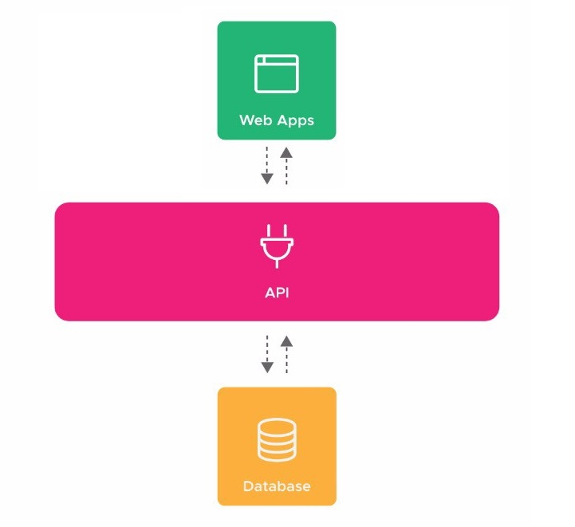

# Sistema MVP 0 para Venda de Imóveis

## 🚀 Projeto final desenvolvido para a Trilha de Python do Campinas Tech Talents.




> API (Application Programming Interface/Interface de Programação de Aplicações), trata-se de um conjunto de rotinas e padrões estabelecidos e documentados por uma aplicação, para que outras aplicações consigam utilizar suas funcionalidades. 
> Toda a comunicação dessa interface é feita via web através de métodos. 
> Os principais métodos são:
> * GET (buscar dados)
> * POST (enviar dados)
> * PUT (atualizar dados)
> * DELETE (deletar dados)


## 🚀 Configurando o ambiente para a execução do projeto

## 💻 Serviços utilizados

Serviços utilizados para a execução do projeto:
* `<Python 3.9>`.
* `<Bancos de Dados PostgreSQL>`.
* `<Flask / Swagger para geração de APIs>`
* `<Angular CLI 9>`


## 💻 Pré-requisitos

```bash
$ pip install python -m venv venv
$ source venv\scripts\activate
$ pip install -r requirements.txt
```
> No terminal do api.py utilizar o comando SET_FLASK=api.py 
```
Na pasta do frontend
$ npm install 
$ ng serve --open
```
> Rodar o `script.sql` no banco de dados ou rodar o api.py que o `db.create.all()` criará o banco. 

### Ajustes e melhorias

As próximas atualizações serão voltadas nas seguintes tarefas:

- [ ] Criação de uma tabela só para endereços;
- [ ] Criação de tabelas domínio para estado civil, tipo de imóveis e tipo de venda;
- [ ] Melhorias no FrontEnd


